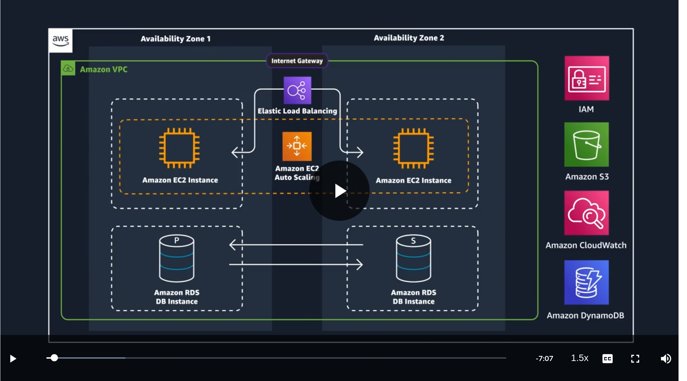
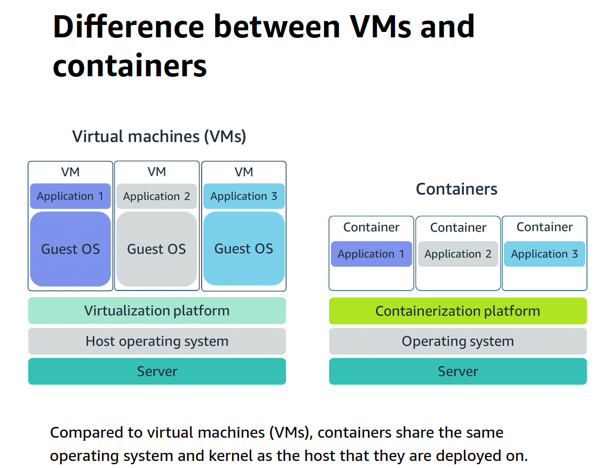
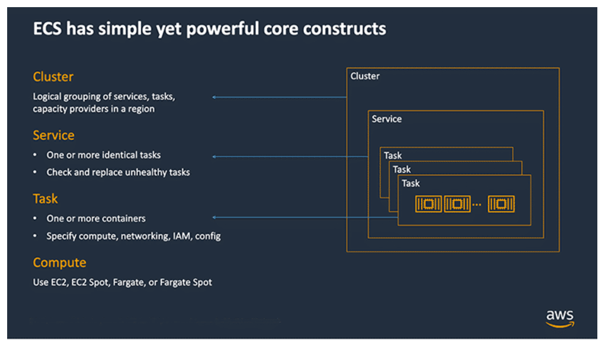
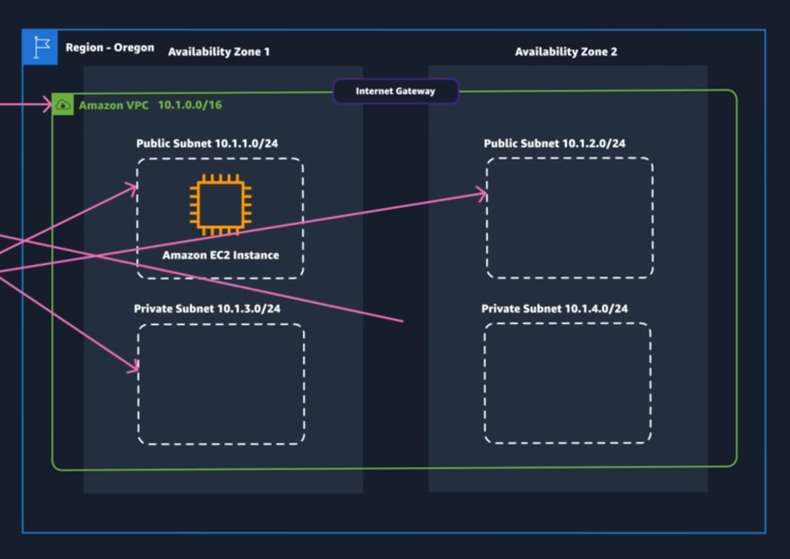
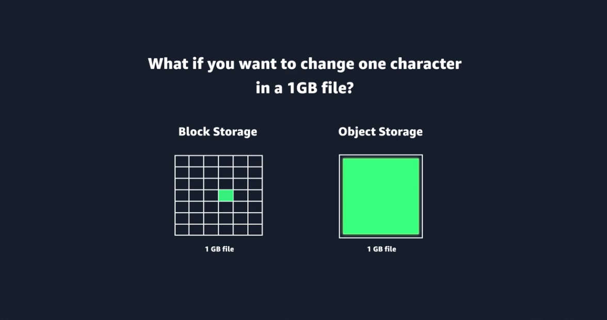
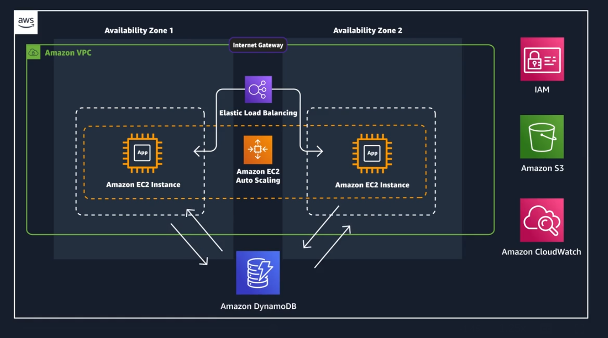

AWT Technical Essentials Its review-
### How to Choose region
* Compliance, regulation
* Latency determined by closeness
* Pricing, some areas may be more expensive
* Check services per region

### AWS API calls
* Console
* CLI
* SDKs

You **should** move to CLI and SDK

https://aws.amazon.com/cli/

Python scripts using sh package

### Temp password temp user utu-cert-ec2Admin
2#zV9'W!

User name,Password,Console sign-in URL
tut-cert-ec2Admin,2#zV9'W!,https://296253502302.signin.aws.amazon.com/console

## Containers
### Container orchestration tools
* Amazon Elastic Container Service (ECS)
* Amazon Elastic Kubernetes Service (EKS)

They offer servies to deal with placement of containers and failure of containers or host instances

This gets complex, especially with many containers but this class doesn't really cover it. Go to docs for more

More manager level pictures:

# Serverless
If you don't need control over the host environment, serverless services my be of use

* With ec2 or containers, you are responsible to patch the OS for updates. 
* The sales pitch is that serverless services are convenient at the cost of control.
*  Also
   *  No servers to manage
   *  scales with usage
   *  Idle resources don't cost
   *  Availability and fault tolerance built in.

[serverless resources](https://aws.amazon.com/serverless/#:~:text=Serverless%20is%20the%20native%20architecture,services%20without%20thinking%20about%20servers.)

#### Services include (plus many more)
* Lambda
* Fargate
* EventBridge
* API Gateway
* S3
* DynamoDb

A serverless app may be implemented with Lambda, ApiGateway, DynamoDb, Amplify
[Sample Code](https://github.com/aws-samples/lambda-refarch-webapp)
[More ed on serverless](https://aws.amazon.com/serverless/getting-started/?serverless.sort-by=item.additionalFields.createdDate&serverless.sort-order=desc)

### Fargate
* ECS and EKS GENERALLY run containers on ec2 instances.
* They can run them on Fargate, a serverless compute service 
  
#### The process
* Build the container and place them in ECR
  * Use ECS to deploy with Fargate

### Lambda
* Lambda functions run in response to a trigger. There are many triggers available.
* Lambda responses are limited to about 15 minutes
* Billed by usage
#### She built a lambda function to resize images
* Iam was a role she had already created
* Trigger was a bucket she had already created
* Code was in a zip file on S3 she had already created
* Tested by using the console to upload an image and then looked at the bucket to see input and output were also created.

# Networking for ec2 (mostly)
### IP addresses

* 4 32 bit numbers in decimal format
    * 192.168.1.30

#### CIDR notation
Still incomplete understanding here
* to express all addresses between 192.168.1.0 and 192.168.1.255:
  * 192.168.1.0/24
  * the /24 indicates 24 ones
    * 255.255.255.0
      * 11111111.11111111.11111111.00000000 
      * the numbers between 0 255 are availabl
      * 00000001 and 11111111
  * /26 means 26 ones
    * 255.255.255.192
      * 11111111.11111111.11111111.11000000
      * The numbers beteen 192 and 255 are available

#### VPC example
* Declare region and range (CIDR)
* To Create, Region (top right), name and CIDR
  * 10.1.0.0.0/16
* Create Subnets (public or private)
  * Needs VPC, AZ you want, CIDR (subset of above)
    * PUBLIC 10.1.1.0/24 for web
    * PRIVATE 10.1.2.0/24 for db calls
  * To Create VPC->Create Subnet (choose VPC), name, choose AZ and set CIDR
* Need an Internet Gateway for web attached to the VPC
  * To Create VPC->Internet Gateway->Create Internet Gateway, Name, create.
    * Details, attach to VPC
* Need an Internet Gateway for Private (not demonstrated)
##### High availability for recovering
Duplicate both subnets in an alternate AZ

##### Route Table
* Now we have 4 subnets, a public and private for each of 2 AZs. They each have unique CIDRs
  *   VPC 10.1.0.0/16
      *   10.1.1.0/24
      *   10.1.2.0/24
      *   10.1.3.0/24
      *   10.1.4.0/24
  *   Need a Route table to direct traffic
      *   Can be applied at VPC or Subnet level
      *   Route tables will exist after creating the subnet- go look at them
          *   If a subnet is listed in the route table from the gateway it has access.
              *   IOW the 'PRIVATE' is determined by the route table alone
      *   Creating a Custom Route table to implement Public and Private subnets:
          *   Not writing all of that as I would never read it :)
          *   This is what she created:

Note that to make the subnets private, just don't place them in the table.
* Probably best to leave the main Route table alone and associate each new subnet with a custom route table

# VPC Security 
* Use ACL (allow deny traffic to ports)
* security groups

THe vid is going to use security groups. Will do both in terraform

# Storage

* Database
* Application files 
  * File Block and Object
  * 
   
## File System
### Elastic File System (EFS)
* Storage grows and shrinks with actual files stored. Pay only for storage, not setup or change fees
* Has a web interface

### FSx  - file storage
* Lustre
* NetApp
* ONTAP 
* OpenZFS
* Windows File Server

## Block Storage
* Ec2 (Elastic Compute Cloud) Instance Storage
  * Directly attached storage
  * Lifecycle is tied to the Instance Store, storage is not seperate. If instance is recreated, storage is lost
* Elastic Block Store EBS (Persistenet storage)
  * Connected to an Ec2 but seperate
  * Attaches to one ec2 at a time (usually)
    * Use EBS MultiAttach to connect to more (limits)
  * SSD and dSSD
  * Backed up with snapshots
* Limitations include must be accessed from an ec2 or (maybe if available in your area and storage) a few EC2s. Also size limits

## Object storage
### S3 (Simple Storage Solution)
* Flat and distributed
* 99.99 % availability
* Bucket is outside contact name with the key
  * Objects placed in bucket
* Everything is private by default
* Bucket policies can only be attached to buckets
  * A policy applies to all objects in a bucket
https://docs.aws.amazon.com/en_us/AmazonS3/latest/userguide/example-bucket-policies.html

# Databases
## RDS ...
## Purpose-built Databases
The tut app has little needs, no relations required, DynamoDb might be right
* Full Contact Management system
  * DocumentDB MongoDB compatabile
* Track Social network
    * Neptune
* Immutable ledger (records can never ber removed)
  * QLDB  
* ElastiCache
* MemoryDB
* Timestream

## DynamoDB
Altered Employee Table

  
  ##